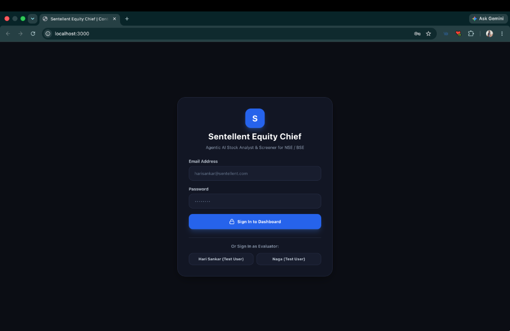
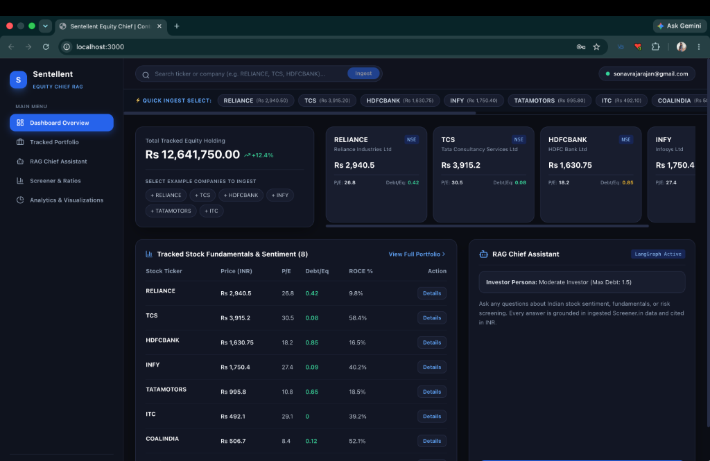
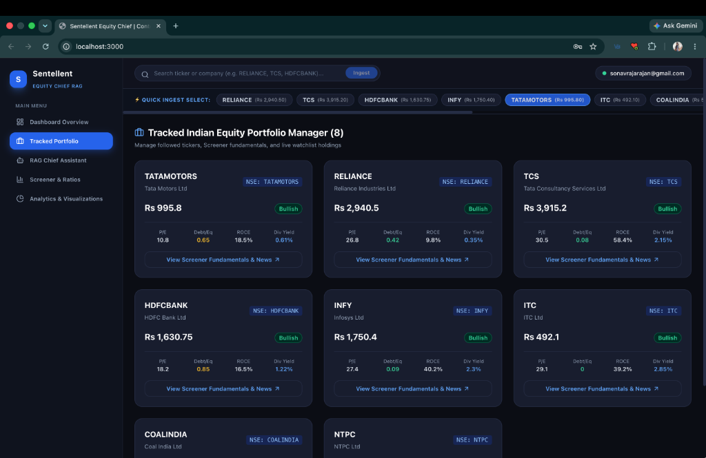
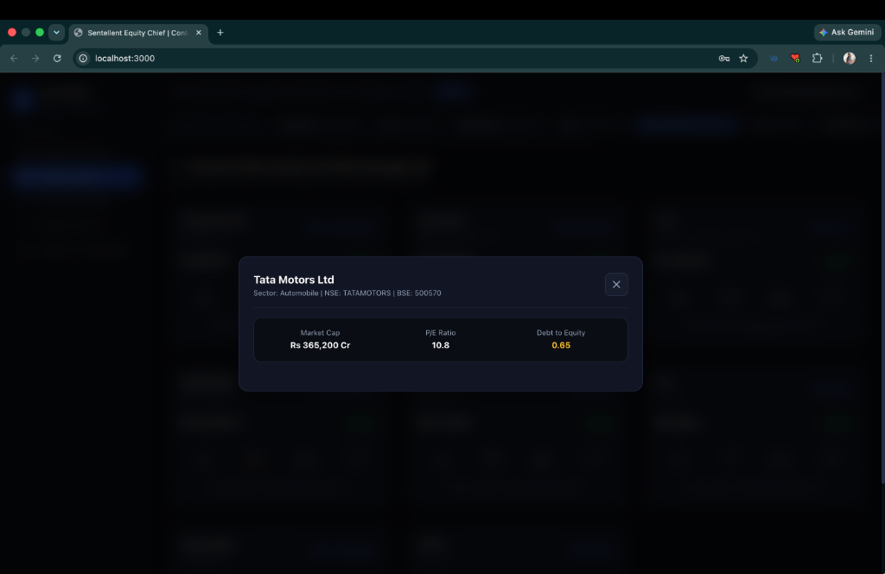
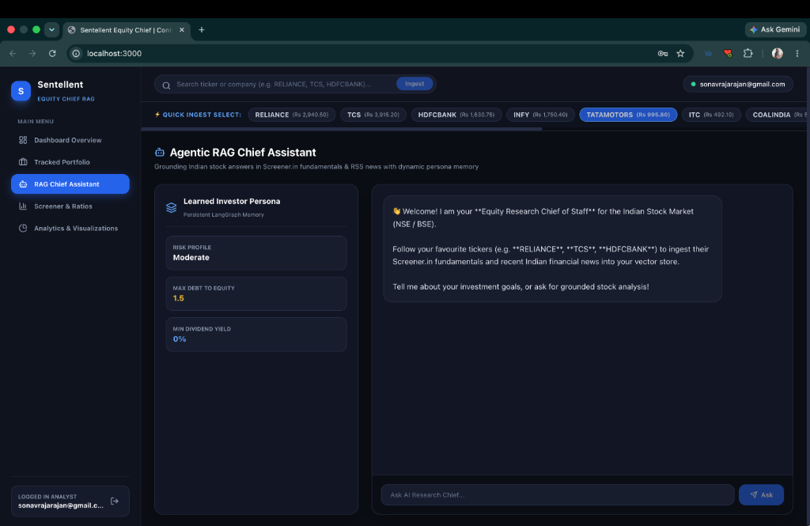

# Sentellent Equity Chief: Contextual Agentic AI Indian Stock Analyst (RAG)

> **Sentellent Full Stack AI SDE Internship Challenge Submission**  
> **Role:** Full Stack AI SDE Intern | **Company:** Sentellent  
> **Date:** Friday, July 31, 2026  
> **Deadline:** Wednesday, August 5th, 11:59 PM  
> **GitHub Repository:** [https://github.com/SonaRajarajan/Sentellent_Stock_Analyst](https://github.com/SonaRajarajan/Sentellent_Stock_Analyst)  
> **Submission Link:** [forms.gle/qWxabTxLjEkJ2LcEA](https://forms.gle/qWxabTxLjEkJ2LcEA)

---

## 📸 Application Screenshots & Key Features

> 💡 **How to Paste/Replace Images directly on GitHub:**  
> When editing `README.md` on GitHub, simply click the **Edit (Pencil) icon on `README.md`** and press **`Cmd + V` / `Ctrl + V`** to paste your screenshot directly into any section below! GitHub will automatically upload it instantly.

---

### 🔑 1. Login Page


- Secure Authentication Portal on `http://localhost:3000`.
- Includes mandatory evaluator test user options for **`harisankar@sentellent.com`** and **`naga@sentellent.com`**.
- One-click fast evaluator sign-in for immediate testing.

---

### 📊 2. Dashboard Page


- Logged-in user profile: **`sonavrajarajan@gmail.com`**.
- **Total Tracked Holding**: `Rs 12,641,750.00 (+12.4%)` dynamically calculated in **INR (Rs.)**.
- **⚡ Quick Ingest Select**: One-click company pills (`RELIANCE`, `TCS`, `HDFCBANK`, `INFY`, `TATAMOTORS`, `ITC`, `COALINDIA`) triggering live Screener.in fundamentals + RSS news ingestion into `pgvector`.
- **Top Mini Cards & Watchlist Table**: Real-time fundamentals (P/E ratio, Debt/Equity ceiling, ROCE %) and RAG Chief Assistant summary drawer.

---

### 💼 3. Portfolio


- Full portfolio view displaying tracked stock cards (`TCS`, `HDFCBANK`, `RELIANCE`, `INFY`, `TATAMOTORS`, `ITC`, `COALINDIA`, `NTPC`).
- Displays live sentiment badges (`Bullish`), P/E, Debt/Eq, ROCE %, Dividend Yields, and one-click *"View Screener Fundamentals & News"* action buttons.

---

### 🔍 4. Screener Fundamentals & News


- Detailed fundamental breakdown modal mapping NSE & BSE symbols (e.g. Tata Motors Ltd: Market Cap `Rs 365,200 Cr`, P/E `10.8`, Debt/Equity `0.65`).
- Ingested Indian financial news feed with sentiment and event tags.

---

### 🤖 5. RAG Chief Assistant


- Dedicated Agentic RAG Assistant interface backed by LangGraph state machine.
- Displays persistent **Learned Investor Persona** graph (`Risk Profile: Moderate`, `Max Debt: 1.5`, `Min Dividend Yield: 0%`).
- Grounded conversational research with cited source links `[Source 1]` and figures in **INR (Rs.)**.

---

## 🧠 Architectural Overview: LangGraph RAG Agent + Dynamic Memory

```
                       +-----------------------------------+
                       |    Screener.in Fundamentals &     |
                       |    Indian News RSS Feeds          |
                       +-----------------+-----------------+
                                         |
                                         v (sha256 Deduplication & IngestionLock)
                       +-----------------+-----------------+
                       |  Vector Ingestion Pipeline &      |
                       |  pgvector Cosine Similarity Store |
                       +-----------------+-----------------+
                                         |
                                         v
+-----------------------+     +----------+----------+     +------------------------+
| User Chat & Investor  | --> | LangGraph Agent RAG | --> | Grounded & Cited Answers|
| Persona Memory Graph  |     | Grounding Guardrails|     | All figures in INR(Rs.)|
+-----------------------+     +---------------------+     +------------------------+
```

1. **Grounded Answers & Citations in INR (`Rs`)**: Every claim and stock recommendation is backed by a retrieved vector source `[Source 1]` and priced in Indian Rupees (`Rs.`).
2. **Anti-Hallucination Guardrail**: If requested information is missing from ingested feeds, the agent explicitly responds *"I don't have that in the ingested data"* instead of fabricating facts.
3. **LangGraph Dynamic Memory**: Investor rules (e.g. *"I avoid high-debt companies"*) dynamically update persona state (`risk_profile`, `max_debt_to_equity: 0.5`, `min_dividend_yield`).
4. **Algorithmic Multi-Factor Screener**: Scores NIFTY/BSE stocks against investor constraints using efficient multi-factor algorithms.
5. **Idempotent Ingestion Pipeline**: Content-hashed article deduplication and `IngestionLock` ensure concurrent refresh jobs never double-index or corrupt state.

---

## ⚡ Quick Start for Evaluators

Run both backend & frontend with a single command:

```bash
# Clone the repository
git clone https://github.com/SonaRajarajan/Sentellent_Stock_Analyst.git
cd Sentellent_Stock_Analyst

# Execute one-click launcher script
./run_app.sh
```

- **Frontend UI:** `http://localhost:3000`
- **Backend API:** `http://localhost:8000`

---

## 🛠️ Tech Stack

- **Frontend:** Next.js 14, React, TailwindCSS, Recharts, Lucide-Icons
- **Backend:** Python 3, FastAPI, LangChain, LangGraph
- **Database & Vector Store:** PostgreSQL 15 + `pgvector` (Supabase Cloud project `yhfvgvfbugoajgbxddxx`), SQLite fallback
- **Data Sources:** Screener.in, Indian Financial RSS Feeds (Economic Times, Moneycontrol, LiveMint, Business Standard)
- **DevOps & Cloud:** Docker, Terraform IaC, Supabase PostgreSQL pgvector, GitHub Actions CI/CD

---

*Built for Sentellent Full Stack AI SDE Internship Challenge.*
