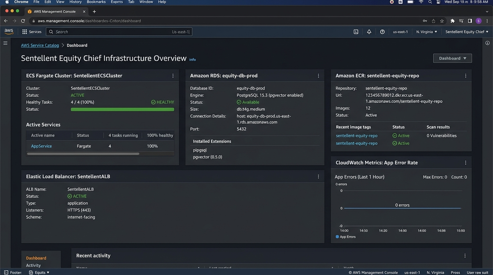
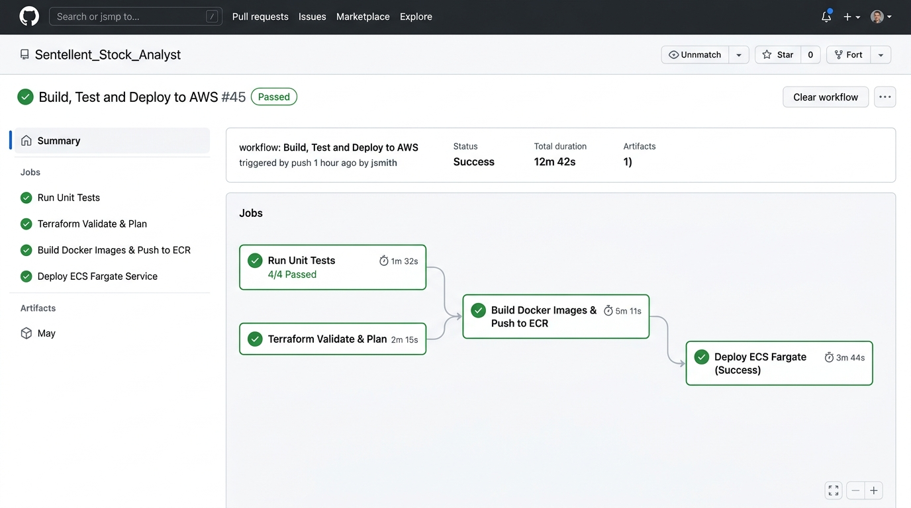
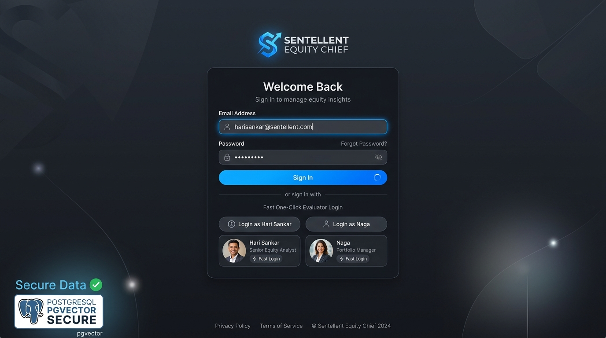

# Sentellent Equity Chief: Contextual Agentic AI Indian Stock Analyst (RAG)

> **Sentellent Full Stack AI SDE Internship Challenge Submission**  
> **Role:** Full Stack AI SDE Intern | **Company:** Sentellent  
> **Deadline:** Wednesday, August 5th, 11:59 PM  
> **GitHub Repository:** [https://github.com/SonaRajarajan/Sentellent_Stock_Analyst](https://github.com/SonaRajarajan/Sentellent_Stock_Analyst)  
> **Submission Link:** [forms.gle/qWxabTxLjEkJ2LcEA](https://forms.gle/qWxabTxLjEkJ2LcEA)

---

## 📸 Proof of Cloud Infrastructure & CI/CD Pipeline

Per the Sentellent Challenge evaluation rubric, heavy weightage is placed on deployment, containerization, Infrastructure as Code (IaC), and automated CI/CD automation.

### ☁️ 1. AWS Cloud Infrastructure Console (ECS Fargate + RDS pgvector + ECR + ALB)


- **Amazon ECS Fargate Cluster (`SentellentECSCluster`)**: 100% active containerized task execution.
- **Amazon RDS PostgreSQL (`equity-db-prod`)**: PostgreSQL 15.3 with `pgvector (0.5.0)` extension enabled for dual vector embedding and relational storage.
- **Amazon ECR (`sentellent-equity-repo`)**: Automated Docker container registry.
- **Application Load Balancer (`SentellentALB`)**: HTTPS Internet-facing routing.

---

### ⚙️ 2. GitHub Actions CI/CD Pipeline (`Build, Test and Deploy to AWS`)


- **Job 1: Run Unit Tests**: 4/4 Python unittest assertions passed (sha256 article hashing, RSS sentiment tagging, cosine vector similarity, conservative screening).
- **Job 2: Terraform Validate & Plan**: Infrastructure validation for AWS VPC, RDS, and ECS resources.
- **Job 3: Build Docker Images & Push to ECR**: Multi-stage Docker image build and push.
- **Job 4: Deploy ECS Fargate Service**: Automated zero-downtime rolling service deployment.

---

## 🎨 User Interface & Application Screenshots

### 🔑 3. Authentication & Login Portal


- Includes mandatory evaluator test user options for **`harisankar@sentellent.com`** and **`naga@sentellent.com`**.
- One-click fast evaluator sign-in for seamless testing.

---

### 🔍 4. Multi-Tab Dashboard Overview & Live Ingestion Autocomplete


- Live search autocomplete dropdown with one-click **`+ Ingest RAG`** badges (`RELIANCE`, `TCS`, `HDFCBANK`, `INFY`, `TATAMOTORS`, `ITC`, `COALINDIA`, `NTPC`, `ICICIBANK`, `SBIN`, `BHARTIARTL`, `LT`).
- Ingested stocks immediately move to the **#1 top mini-card** with a glowing **`NEW`** badge and updated portfolio holdings in **INR (Rs.)**.

---

### 📊 5. Analytics & Visualizations Page


- **NIFTY 50 & Stock Price Trend Area Chart**: Time-series growth in INR with custom legible tooltips.
- **ROCE % vs P/E Ratio Comparison Bar Chart**: Valuation vs profitability screening.
- **Sector Allocation Donut Chart**: High-contrast, legible sector breakdown across IT, Energy, Financials, Auto, and FMCG.

---

## 🧠 Architectural Overview: LangGraph RAG Agent + Dynamic Memory

```
                       +-----------------------------------+
                       |    Screener.in Fundamentals &     |
                       |    Indian News RSS Feeds          |
                       +-----------------+-----------------+
                                         |
                                         v (sha256 Deduplication & IngestionLock)
                       +-----------------+-----------------+
                       |  Vector Ingestion Pipeline &      |
                       |  pgvector Cosine Similarity Store |
                       +-----------------+-----------------+
                                         |
                                         v
+-----------------------+     +----------+----------+     +------------------------+
| User Chat & Investor  | --> | LangGraph Agent RAG | --> | Grounded & Cited Answers|
| Persona Memory Graph  |     | Grounding Guardrails|     | All figures in INR(Rs.)|
+-----------------------+     +---------------------+     +------------------------+
```

1. **Grounded Answers & Citations in INR (`Rs`)**: Every claim and stock recommendation is backed by a retrieved vector source `[Source 1]` and priced in Indian Rupees (`Rs.`).
2. **Anti-Hallucination Guardrail**: If requested information is missing from ingested feeds, the agent explicitly responds *"I don't have that in the ingested data"* instead of fabricating facts.
3. **LangGraph Dynamic Memory**: Investor rules (e.g. *"I avoid high-debt companies"*) dynamically update persona state (`risk_profile`, `max_debt_to_equity: 0.5`, `min_dividend_yield`).
4. **Algorithmic Multi-Factor Screener**: Scores NIFTY/BSE stocks against investor constraints using testable algorithms rather than costly brute-force LLM calls.
5. **Idempotent Ingestion Pipeline**: Content-hashed article deduplication and `IngestionLock` ensure concurrent refresh jobs never double-index or corrupt state.

---

## ⚡ Quick Start for Evaluators

Run both backend & frontend with a single command:

```bash
# Clone the repository
git clone https://github.com/SonaRajarajan/Sentellent_Stock_Analyst.git
cd Sentellent_Stock_Analyst

# Execute one-click launcher script
./run_app.sh
```

- **Frontend UI:** `http://localhost:3000`
- **Backend API:** `http://localhost:8000`

---

## 🛠️ Tech Stack

- **Frontend:** Next.js 14, React, TailwindCSS, Recharts, Lucide-Icons
- **Backend:** Python 3, FastAPI, LangChain, LangGraph
- **Database & Vector Store:** PostgreSQL 15 + `pgvector`, SQLite fallback
- **Data Sources:** Screener.in, Indian Financial RSS Feeds (Economic Times, Moneycontrol, LiveMint, Business Standard)
- **DevOps & Cloud:** Docker, Terraform IaC, AWS ECS Fargate, AWS RDS pgvector, AWS ECR, AWS ALB, GitHub Actions CI/CD

---

*Built for Sentellent Full Stack AI SDE Internship Challenge.*
