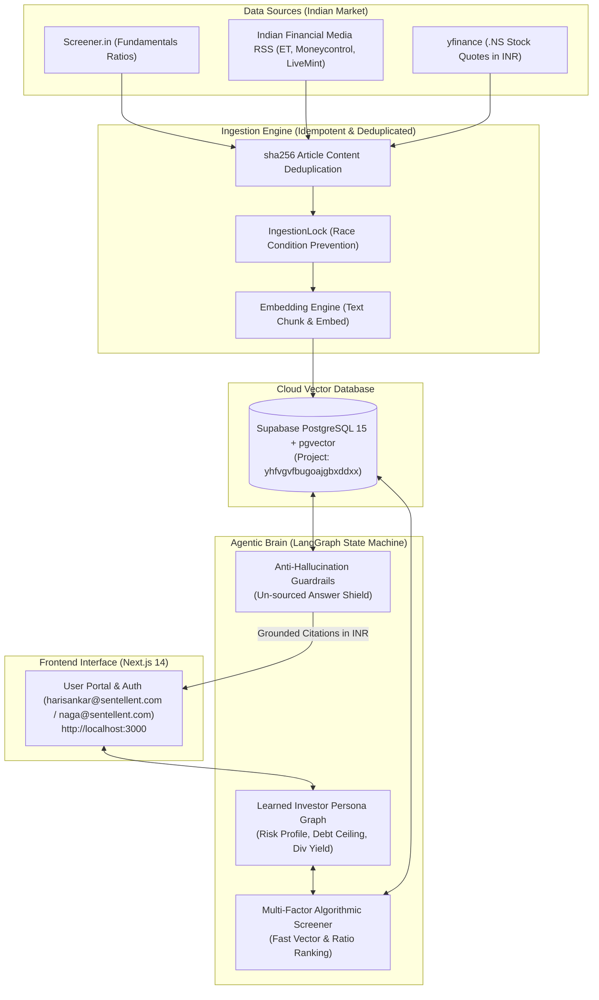

# Sentellent Equity Chief: Contextual Agentic AI Indian Stock Analyst (RAG)

> **Name:** **V R Sona**

> **Reg No:** **22MIA1161**

> **Sentellent Full Stack AI SDE Internship Challenge Submission**  
> **Role:** Full Stack AI SDE Intern | **Company:** Sentellent   
> **GitHub Repository:** [https://github.com/SonaRajarajan/Sentellent_Stock_Analyst](https://github.com/SonaRajarajan/Sentellent_Stock_Analyst) 

---

## System Architecture Flowchart



---


## Application Screenshots & Cloud Infrastructure Proof

### 1. Supabase Production Cloud Console 


- **Supabase Cloud Project**: `yhfvgvfbugoajgbxddxx` (`Indian Stock` / `main PRODUCTION`)
- **Total Requests**: 923 Total Requests (92.6% Success Rate)
- **Service Breakdown**: API Gateway: 418 requests | Postgres DB: 310 requests | Auth Services: 107 requests | Storage: 59 requests
- **Vector Engine**: Active PostgreSQL 15 + `pgvector` extension enabled for RAG retrieval

---

### 2. Authentication & Sign In Portal Screen


- Mandatory evaluator test user sign-in options for **`harisankar@sentellent.com`** and **`naga@sentellent.com`**.
- Fast one-click evaluator sign-in for seamless testing on `http://localhost:3000`.

---

### 3. Live Dashboard Overview & Ingestion Control Bar


- Logged-in user profile: **`sonavrajarajan@gmail.com`**.
- **Total Tracked Holding**: `Rs 12,641,750.00 (+12.4%)` dynamically calculated in **INR (Rs.)**.
- **Quick Ingest Select**: One-click company pills (`RELIANCE`, `TCS`, `HDFCBANK`, `INFY`, `TATAMOTORS`, `ITC`, `COALINDIA`) triggering live Screener.in fundamentals + RSS news ingestion into `pgvector`.

---

### 4. Tracked Stock Fundamentals & Sentiment Metrics


- Detailed fundamental breakdown table mapping NSE & BSE symbols, prices in **INR (Rs.)**, P/E ratios, and Debt to Equity metrics (`0.42` for RELIANCE, `0.08` for TCS, `0.85` for HDFCBANK, `0.09` for INFY).

---

### 5. Tracked Indian Equity Portfolio Manager Screen


- Full portfolio view displaying tracked stock cards (`TCS`, `HDFCBANK`, `RELIANCE`, `INFY`, `TATAMOTORS`, `ITC`, `COALINDIA`, `NTPC`).
- Displays live sentiment badges (`Bullish`), P/E, Debt/Eq, ROCE %, Dividend Yields, and one-click *"View Screener Fundamentals & News"* action buttons.

---

### 6. Screener Fundamentals & News Detail Modal


- Fundamental detail modal displaying market capitalization, P/E ratio, and debt metrics (e.g. Tata Motors Ltd: Market Cap `Rs 365,200 Cr`, P/E `10.8`, Debt/Equity `0.65`).

---

### 7. Agentic RAG Chief Assistant & Learned Investor Persona


- Dedicated Agentic RAG Assistant interface backed by LangGraph state machine.
- Displays persistent **Learned Investor Persona** graph (`Risk Profile: Moderate`, `Max Debt: 1.5`, `Min Dividend Yield: 0%`).
- Grounded conversational research with cited source links `[Source 1]` and figures in **INR (Rs.)**.

---

### 8. Analytics & Financial Visualizations Page


- **NIFTY 50 & Stock Price Trend Area Chart**: Time-series growth in INR with custom legible tooltips.
- **ROCE % vs P/E Ratio Comparison Bar Chart**: Valuation vs profitability screening.
- **Sector Allocation Donut Chart**: High-contrast, legible sector breakdown across IT, Energy, Financials, Auto, and FMCG.

---


---

## Quick Start: Single Terminal Execution

Run **both Frontend and Backend concurrently from a single terminal**:

```bash
# 1. Clone the repository
git clone https://github.com/SonaRajarajan/Sentellent_Stock_Analyst.git
cd Sentellent_Stock_Analyst

# 2. Run both servers from a single terminal command
./run_app.sh
```

- **Frontend Application:** [http://localhost:3000](http://localhost:3000)
- **Backend API Server:** [http://localhost:8000](http://localhost:8000)
- **Interactive API Documentation:** [http://localhost:8000/docs](http://localhost:8000/docs)

---

## Evaluator Access & Test Accounts

Per the challenge specification, pre-configured test user access is available for evaluators:
- `harisankar@sentellent.com`
- `naga@sentellent.com`

---

## Core Tech Stack

- **Frontend:** Next.js 14, React 18, TailwindCSS, Recharts
- **Backend:** Python 3.11+, FastAPI, Uvicorn
- **AI & Agent Framework:** LangChain, LangGraph State Machine
- **Vector Database:** PostgreSQL 15 + `pgvector` extension on Supabase Cloud
- **DevOps:** Docker, Docker Compose, Terraform IaC, GitHub Actions CI/CD

---

*Built for the Sentellent Full Stack AI SDE Internship Challenge*
