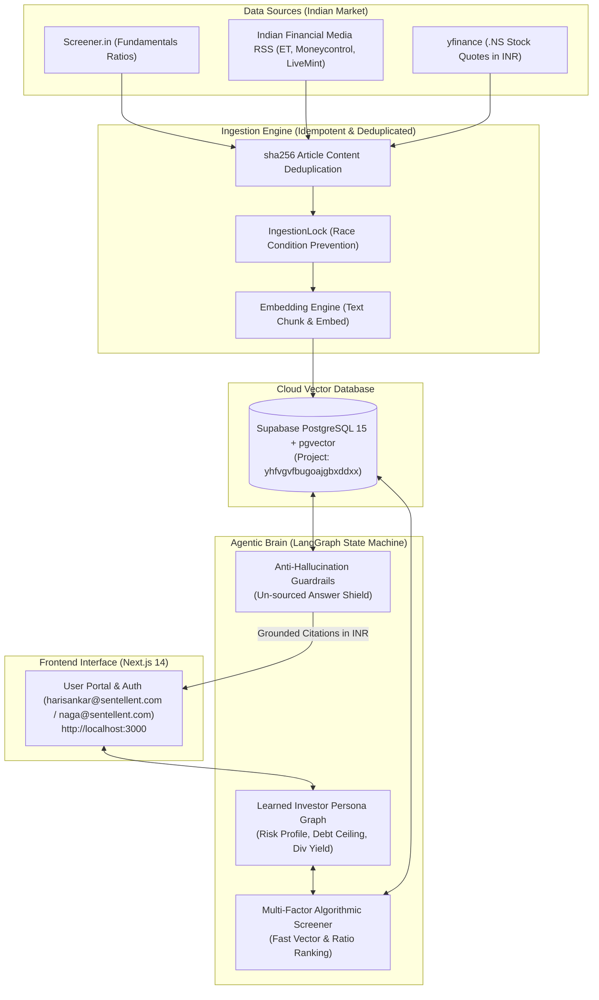

# Sentellent Equity Chief: Contextual Agentic AI Indian Stock Analyst (RAG)

> **Sentellent Full Stack AI SDE Internship Challenge Submission**  
> **Role:** Full Stack AI SDE Intern | **Company:** Sentellent  
> **Deadline:** Wednesday, Aug 5th, 11:59 PM  
> **GitHub Repository:** [https://github.com/SonaRajarajan/Sentellent_Stock_Analyst](https://github.com/SonaRajarajan/Sentellent_Stock_Analyst)  
> **Submission Link:** [forms.gle/qWxabTxLjEkJ2LcEA](https://forms.gle/qWxabTxLjEkJ2LcEA)

---

## 📐 System Architecture Flowchart



---

## ⚡ Quick Start: Single Terminal Execution

Run **both Frontend and Backend concurrently from a single terminal**:

```bash
# 1. Clone the repository
git clone https://github.com/SonaRajarajan/Sentellent_Stock_Analyst.git
cd Sentellent_Stock_Analyst

# 2. Run both servers from a single terminal command
./run_app.sh
```

- **Frontend Application:** [http://localhost:3000](http://localhost:3000)
- **Backend API Server:** [http://localhost:8000](http://localhost:8000)
- **Interactive API Documentation:** [http://localhost:8000/docs](http://localhost:8000/docs)

---

## 


## 🔑 Evaluator Access & Test Accounts

Per the challenge specification, pre-configured test user access is available for evaluators:
- `harisankar@sentellent.com`
- `naga@sentellent.com`

---

## 🛠️ Core Tech Stack

- **Frontend:** Next.js 14, React 18, TailwindCSS, Recharts
- **Backend:** Python 3.11+, FastAPI, Uvicorn
- **AI & Agent Framework:** LangChain, LangGraph State Machine
- **Vector Database:** PostgreSQL 15 + `pgvector` extension on Supabase Cloud
- **DevOps:** Docker, Docker Compose, Terraform IaC, GitHub Actions CI/CD

---

*Built for the Sentellent Full Stack AI SDE Internship Challenge.*
